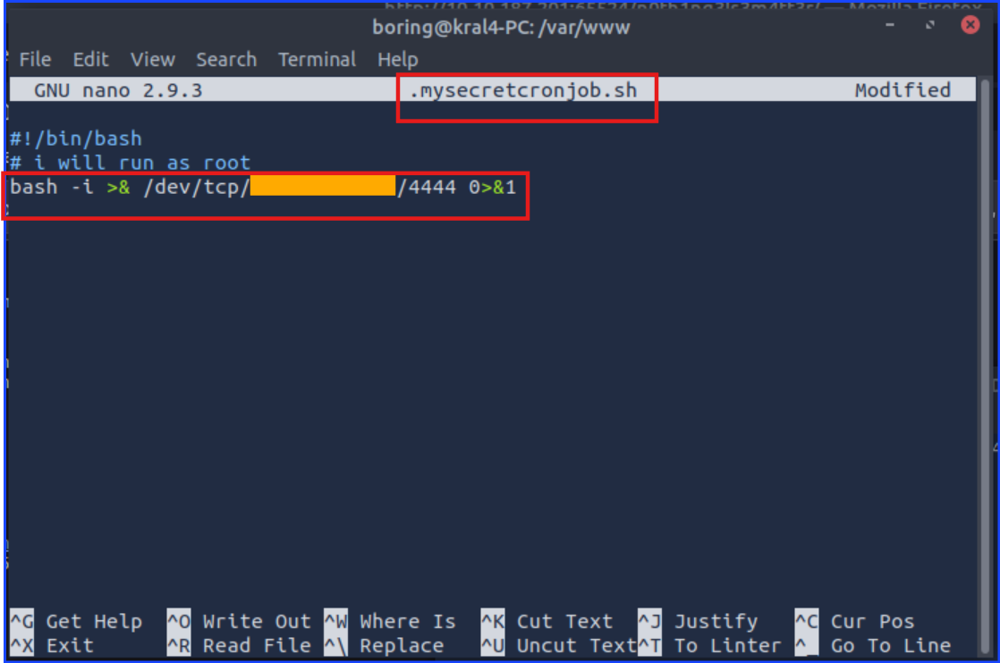

# TryHackMe Walkthrough
### Room: Easy Peasy

I choose this room because the description said it focused on enumeration using Nmap and Gobuster. I thought it would be a good review for me so I got started in it.
After connecting my Kali VM to the target machine in this room, I started off with scanning for the open ports and services.

```sudo nmap -sS -sV -p- <target_IP> -oA result```

The flags `-p-` tells nmap to scan all ports, `-sS` tells nmap to do SYN scan, `-sV` tells nmap to check the version of the services it finds, the `-oA` tells nmap to write the scan result into files in all format with "result" as its based-name.
Nmap can scan multiple targets IP at once, but since we have only 1 target in this room, I did not put it in a separated file called "targetsList.txt".

Here is the screenshot of it.


I found that there are 3 open ports.

***Q1: How many ports are open?***
***A1: 3***

***Q2: What is the version of nginx?***
***A2: 1.16.1***

***Q3: What is running on the highest port?***
***A3: Apache***

Taking a closer look at the Nmap result, I saw Nginx and Apache. This means that the next thing to investigate is a website or HTTP service.
From here, the question mentioned using `gobuster` which gives a hint that I have to do some directory bruteforcing in the next step.


Here I found the directory called `/hidden` so it is the next thing for me to check it out. I also tried to check the `/index.html` and `/robots.txt` as well.

I keep using `gobuster` to enumerate further until I get to `/hidden/whatever/`


Then, I navigate to `/hidden/whatever` directory.


Then, I viewed its source code and found something that has the potential to be a flag or a hidden message in the source code.


Then, I use `cyberchef` to decode it.


***Q4: Using GoBuster, find flag 1.***
***A4: flag{f1rs7_fl4g}***

Then, I enumerate further to find flag 2. This flag is tricky to find. I admit I found flag 3 before flag 2, but for the sake of easy to understand, in this walkthrough I will talk about flag 2 before flag 3.

This time I enumerate Apache which uses the port 65524.


Then, I faced with ***User-agent** which can be cracked using `md5hash`.


***Q5: Further enumerate the machine, what is flag 2?***
***A5: flag{1m_s3c0nd_fl4g}***

Looking at the source code of the main page of the `IP:65524`.


The instruction told me to crack it with easypeasy.txt so I did as instructed. 

***Q6: Crack the hash with easypeasy.txt, What is the flag 3?***
***A6: flag{9fdafbd64c47471a8f54cd3fc64cd312}***

Looking further in the same source code page, I found flag 3 hid there as shown in the screenshot below. The `ba...` part was a hint saying it is `baseXX`.


I cracked it using `CyberChef` again.


***Q7: What is the hidden directory?***
***A7: /n0th1ng3ls3m4tt3r***

Now, I navigated to the directory `/n0th1ng3ls3m4tt3r`. 

Looking at the source code, I found another hidden message.

The instruction told me to crack this with hash with the given text file, easypeasy.txt, so I cracked it with `john`.


***Q8: Using the wordlist that provided to you in this task crack the hash, what is the password?***
***A8: mypasswordforthatjob***

Switching back to the main page, there was a stand out image there. Then, I took a look at the source code and found that the stand-out picture was downloadable so I downloaded it.


From here, I performed stegnography to get the hash.


Reading secrettext.txt, I found the SSH's username and password. In order to get the password, I converted the binary to ASCII.


***Q9: What is the password to login to the machine via SSH?***
***A9: iconvertedmypasswordtobinary***

At this point, I am ready to login through SSH.


After logining in, I checked who I am whether I am a regular user or a root using `whoami` command. After knowing I am a user and not root, I looked for the user's flag.


I cracked it using ROT13.


***Q10: What is the user flag?***
***A10: flag{n0wits33msn0rm4l}***

Now that I got the user's flag, I need to find a way to escalate into root and get the root flag. I checked `crontab` and found that I have can modify the file `.mysecretcronjob.sh` by writing any command or code to that file and let `cronjob` do it works and run it with root priviledge.


I admit I thought I just used `cat` to run this file and I will be able become root. That was one of the methods to escalate the priviledge if user has `sudo cat` priviledge or if user has root privilege to run `cat` as root, but this wasn't the correct way to escalate the privilege in this room. 

I stumbled with this for a while until I finally understood that the text ***# i will run as root*** means whatever code I typed into this file will be run as root.

After I realized that, I knew that I needed to add an RCE payload there so I searched for a reverse shell payload, picked the suitable one, and wrote it into that file and waited for the `cronjob` to run it as root. 

Before I let `cron` run, I setup a `netcat` listener waiting for the RCE connection.




I was dealing with bash shell so I chose the bash reverse shell payload. `4444` was the listening port that I set my `netcat` listener to. The yellow bar censor was my AttackBox IP. It was the IP of the listener machine and not the IP of the target machine.


Now that I had received the reverse shell with root access, I searched for the root flag which located in the `/root`.

The flag was in the file `.root.txt`. 


***Q11: What is the root flag?***
***A11: flag{63a9f0ea7bb98050796b649e85481845}***

### My thought after I have completed this room.

This room was not as easy as I thought. I decided to work on it because I saw that it focused was to improve `nmap` and `gobuster` skills.
I struggled with the tasks that relied on cracking the encoding messages. 

Also, this is my very first walkthrough that I wrote. Please excused me for the imperfection of it. Working on it, I realized the important of labeling my screenshots.

Thank you for reading until the end.

Cheer,
Sangsongthong