# TryHackMe Walkthrough

## Room: GoldenEye

## Difficulty Level: Medium

I really like this room because I am a fan of Bond movie. I grew up with it so imagine my thrilled to work on this room.
Personal reasons aside, I think this room is very realistic on the easy side of the hacking. It followed the hacking steps from enumeration to privilege escalation. It gives the beginner hacker like myself the overview of what to expect.
It has leaked credentials so we learned how easy it is to compromise a machine if we can find leaked credential and weak passwords.
Then, I got a taste of using an exploit to exploit the system. It was not just download an exploit and be able to use it right away. I had to do something more to make the exploit usable for my case. Then, I got a taste of escalating my privilege to root.
Another thing that I like about this room is the fact that it keeps decoding to the moderate and acceptable level. While it contained some decoding tasks, they were not excessive to the point of shifting the focus of the room into decoding rather than hacking. While I accept that decoding is a useful skill, it felt too much of a CTF and less of a realistic scenario for an aspiring ethical hacker to train. I personally do not believe that real companies or real users use that many encoding in their system.

Without further ado, let me explain what I have done in details below.

## **Task 1: Intro & Enumeration"**

After I started my target machine and connect my Kali to the VPN, I scanned the target machine using `nmap`. I also navigated to the target machine's website.

Here is the nmap command I used.

```sudo nmap -sS -sV -Pn -p- <target_IP> -oA goldenEyeNmapResult -T4```

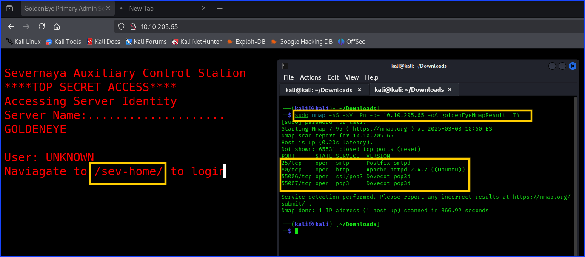

***Q1: Use nmap to scan the network for all ports. How many ports are open?***
***A1: 4***

As you can see from the screenshot above, the website told me to navigate to `<target_IP>/sev-home/` to access the login page. Having this information, my mind instantly thinking of credential leaks, login credential brute force, and weak passwords.

Before I headed to the login site, it was a good idea to check the source code of the page in case I get something useful and I did.

Here is the screenshot of the source code. As you can see that the `terminal.js` is an interesting file worth checking so I checked.

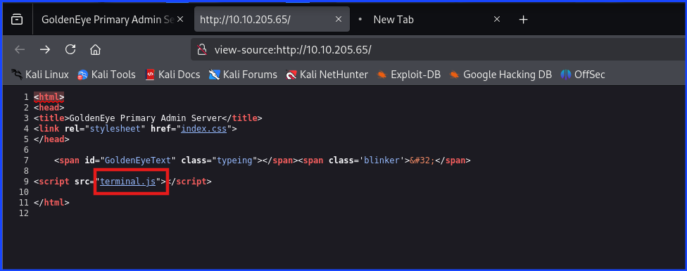

I navigated to `terminal.js` and found that someone's name `Boris` need to update his password.

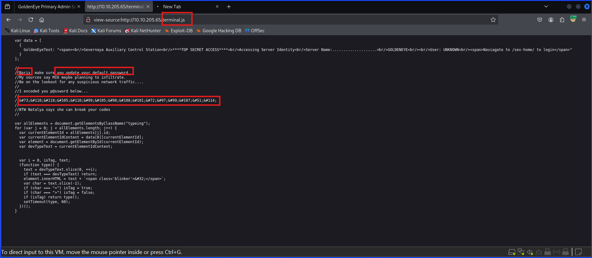

***Q2: Who needs to make sure they update their default password?***
***A2: boris***

In the screenshot above, there was Boris's encoded password. All I needed to do was to crack it and I did.

***Q3: Whats their password?***
***A3: InvincibleHack3r***

Now that I have the credential, it's time for me to login into the website using the username and password I got.

The username was `boris`. I tried with the capital letter `B` and it did not work. The correct username spelled with `b`.

The password was the one I decoded from the source code.

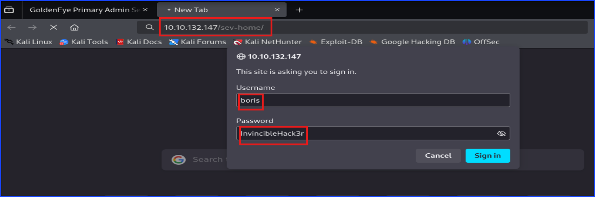

## **Task 2: Its mail time...**

After logining in, I found this. It told us about POP3 service running in the non-default port.

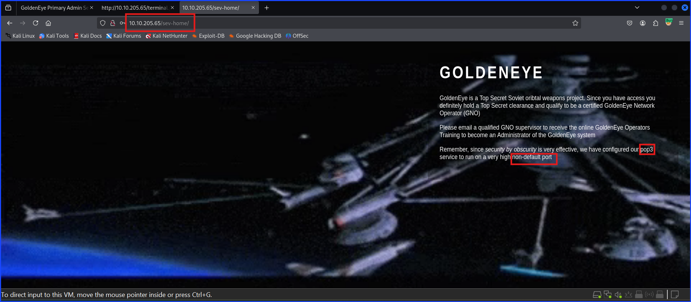

Re-call back to the `nmap` result, port `55006` and `55007` run POP3 service.

I used `netcat` to check and grab the banner of the POP3 service. The command I use was `nc <target_IP> <non_default_port>`

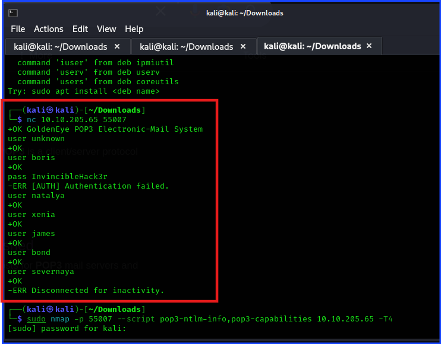

This successful connection told me that I can connect to their POP3 service. I tried testing their commands, but all I got were `user` and `pass`. I tried to user the `user` command to verify users there but it seems to give out `+OK` to everything I typed in after the `user` command. I even tried typing a made-up name or inappropriate word just to trigger `-ERR` flag but it still returned `+OK`. This concluded that I couldn't verify users with the `user` command.

I tried to log into Boris's account using the same username and password, but it was not successful. This means I have to find another way in.

The hint told me to use `Hydra` to brute force the login password so I did.

The thing I noticed here was that when facing a situation like this, brute forcing the login password can be a smart step to give it a try.

Here is what I did using `Hydra`. It took a while before I got the command right and I got the result.

The command was `hydra -l <username> -P <wordlist-text-file> <target_IP> -s <port> <service>`

`hydra l boris -P /usr/share/wordlists/fasttrack.txt <target_IP> -s 55007 pop3`

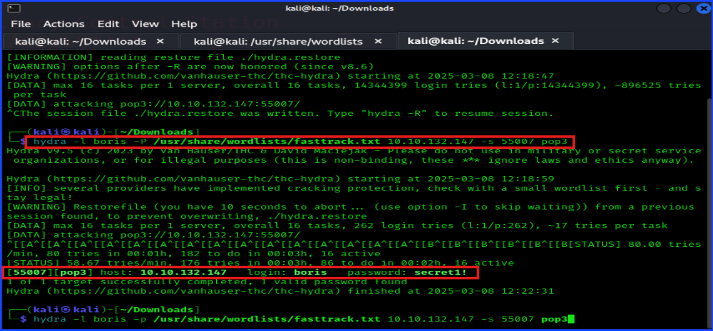

***Q4: If those creds don't seem to work, can you use another program to find other users and passwords? Maybe Hydra?Whats their new password?***
***Hint: POP3***
***A4: secret1!***

Tackling the next question, it asked what service was using the port 55007. It was POP3.

***Q5: Inspect port 55007, what service is configured to use this port?***
***A5: pop3***

POP3 is an email service.

***Q6: What can you find on this service?***
***A6: emails***

Using the password obtaining from using `hydra` to brute force, I was able to login as shown in the screenshot below.

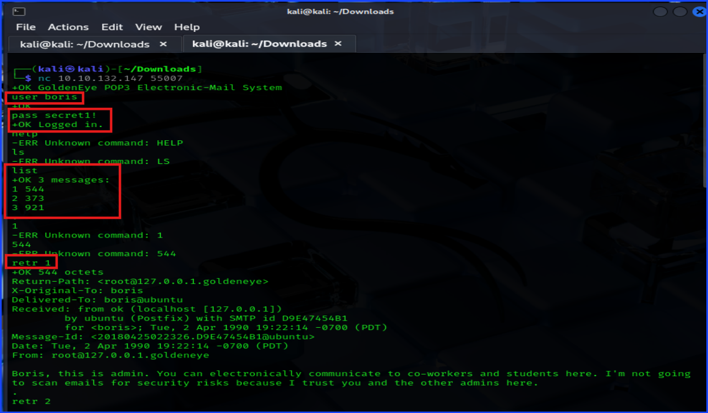

Since I was not familiar with POP3 commands, I googled POP3 commands and found `retr <number_of_the_email>` and `list` to be useful commands.

`list` command is used to list all emails in the inbox.

`retr` command is used to retrieve a specific email.

Went back to take a look at the `target.js` source code, it said `Natalya` could break `Boris` code. In one of the emails, this was re-stated again.

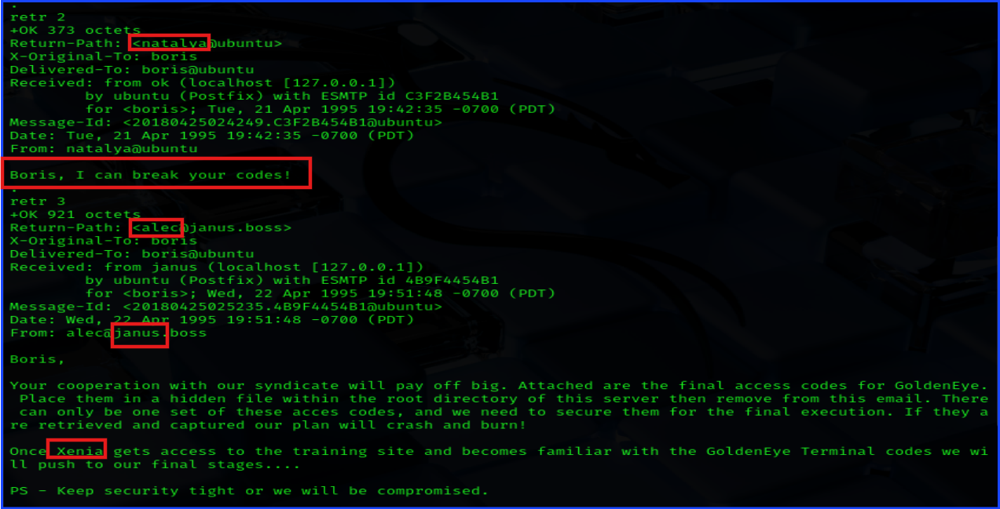

***Q7: What user can break Boris' codes?***
***A7: Natalya***

I also got other usernames.

***Keep enumerating users using this service and keep attempting to obtain their passwords via dictionary attacks.***
***Hint: You will eventually get a xenia's password in plaintext.***

Repeated the same password brute force method using `hydra` with the new user that I found, `Natalya`.

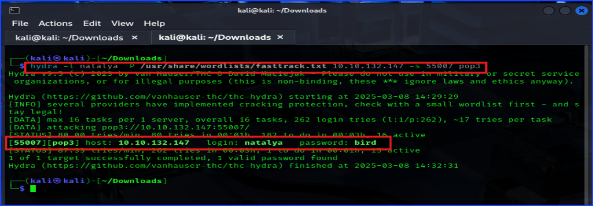

Login using `natalya` and read her emails.

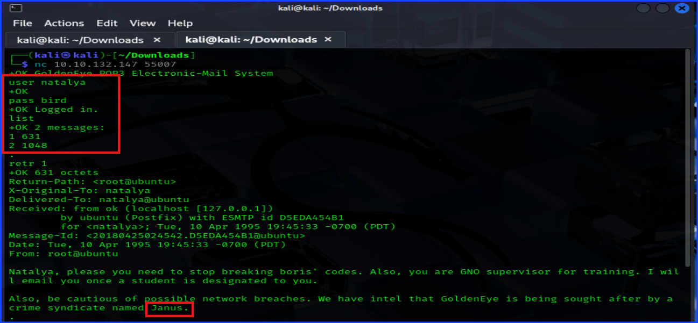

I read her email 2 and got `Xenia`'s password in clear text.


I also got an internal domain information from this email to work on next.

## **Task 3: GoldenEye Operators Training**

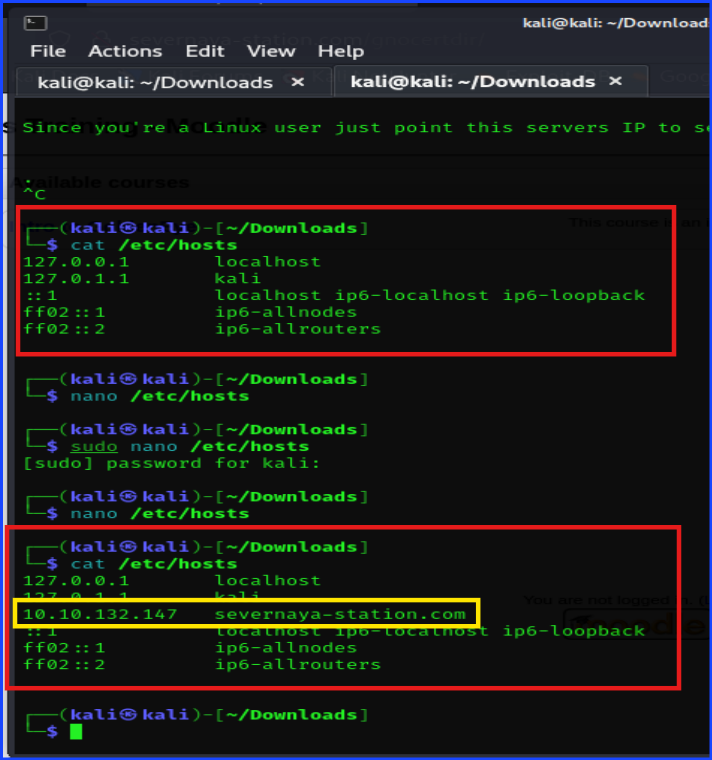

***Q8: Try using the credentials you found earlier. Which user can you login as?***
***A8: xenia***

***Q9: Have a poke around the site. What other user can you find?***
***A9: doak***

***Q10: What was this users password?***
***Hint: pop3 + hydra***
***A10: goat***

***Q11: What is the next user you can find from doak?***
***Hint: Emails, emails, emails..***
***A11: dr_doak***

***Q12: What is this users password?***
***A12: 4England!***

***Download the attachments and see if there are any hidden messages inside them?***
***Hint: Use exiftool***

***As this user has more site privileges, you are able to edit the moodles settings. From here get a reverse shell using python and netcat.***

***Take a look into Aspell, the spell checker plugin.***
***Hint: Settings->Aspell->Path to aspell field, add your code to be executed. Then create a new page and "spell check it".***

## **Task 4: Privilege Escalation**

***Q13: Whats the kernel version?***
***Hint: `uname -a`***
***A13: 3.13.0-32-generic***

You can download the exploit from here: [exploit](https://www.exploit-db.com/exploits/37292)

***Fix the exploit to work with the system you're trying to exploit. Remember, enumeration is your key!***
***What development tools are installed on the machine?***

Getting the root flag. As you can see here, everything inside `/root` directory was hidden. In oder to see them on screen, use `ls -la`.

Now you can see `.flag.txt` file. All you need to do was using `cat` command to see the flag.

The command was `cat <file>`.

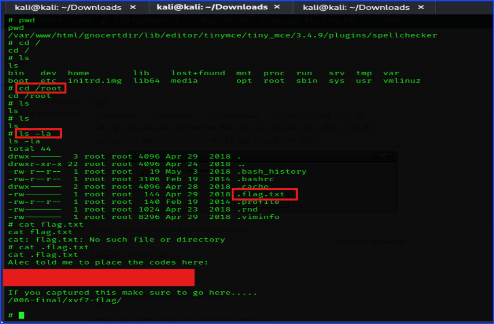

***Q14: What is the root flag?***
***Hint: This is located in the root user folder.***
***A14: 568628e0d993b1973adc718237da6e93***

***Bonus Scene: Let's the fangirl in me shine!***

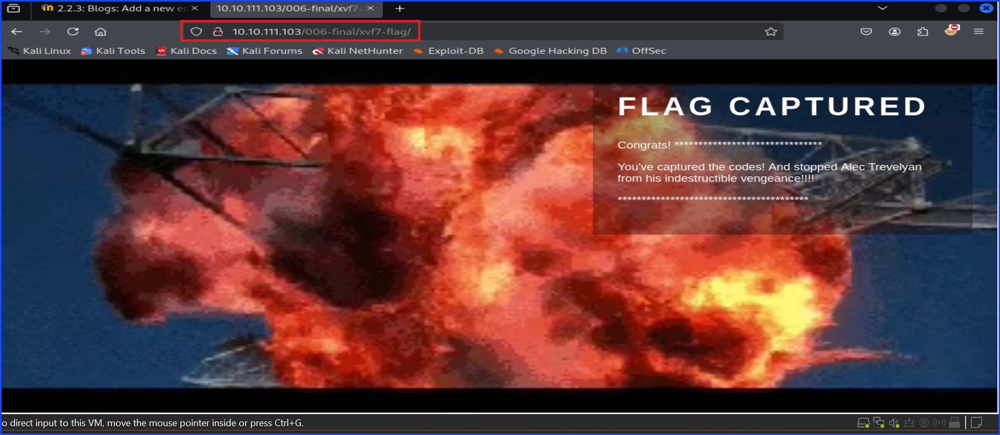

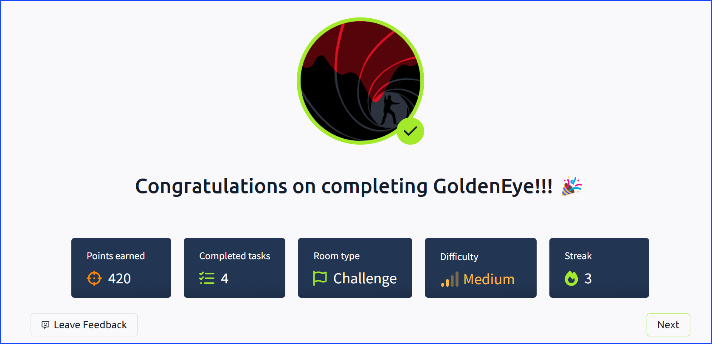

Thank you so much for reading this till the end.

***Sangsongthong***

<!--The image path shouldn't have / in front of Screenshots.I made a mistake by typing /Screenshots instead of Screenshots making the images not display properly on GitHub even though I can see them on the preview on my local machine. This comment is invisible, by the way.-->
